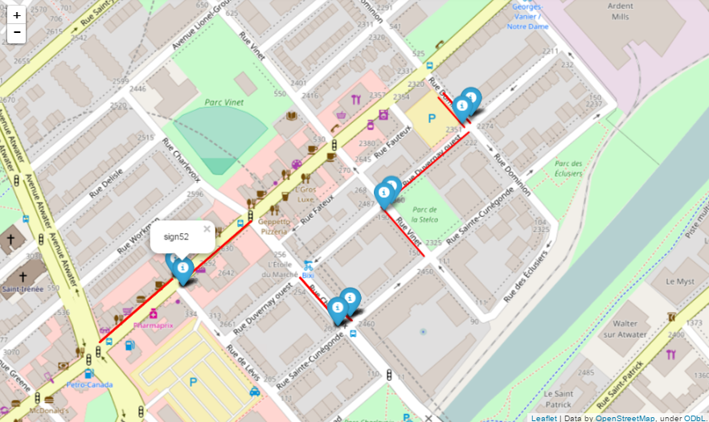

# Montreal Street Parking
This directory includes the script and notebook files for the following dataset: 
https://www.kaggle.com/mnabaee/mtlstreetparking

This dataset includes the coordinates of the street segments as well as the parking signals in the City of Montreal.

##Using TensorFlow for Distributed Computing
Since the calculation of the closest street segments for all of the parking signs takes a long time, it was necessary to run it on multiple machines. Specifically, the signs were split into multiple smaller sets and each set was processed on a different machine. This task was done using the [distributed computing capabilities in TensorFlow](https://www.tensorflow.org/versions/r0.12/how_tos/distributed/index.html).

A few samples of the results are shown in the following map. Each marker in the map represents the location of a parking sign and the red line segment is the corresponding segment which is found to be closest to the sign.

