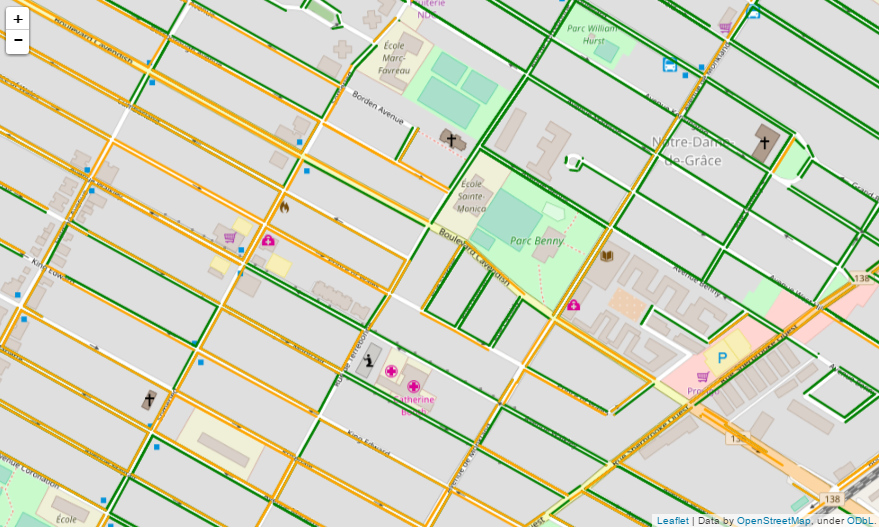

# Montreal Street Parking
This directory includes the script and notebook files for the following dataset:<br/>
https://www.kaggle.com/mnabaee/mtlstreetparking

This dataset includes the coordinates of the street segments as well as the parking signals in the City of Montreal.

##Using TensorFlow for Distributed Calculation of Closest Street Segments
Since the calculation of the closest street segments for all of the parking signs takes a long time, it was necessary to run it on multiple machines. Specifically, the signs were split into multiple smaller sets and each set was processed on a different machine. This task was done using the [distributed computing capabilities in TensorFlow](https://www.tensorflow.org/versions/r0.12/how_tos/distributed/index.html).

###Creating the cluster and running workers
To create a cluster of workers on the same or different machines, you need to use [this script](https://github.com/mnabaee/kernels/blob/master/mtl-street-parking/create_worker.py).
The line
```
cluster = tf.train.ClusterSpec(
  {"tfworker":["localhost:2222", "localhost:2223", "localhost:2224", "localhost:2225"]}
  )
```
specifies the whole cluster; i.e. which host and ip each worker module is running.
Our above example cluster specification is for 4 workers all running on localhost listening to ports 2222 to 2225.
To run each worker, you need to execute `create_worker.py` script with different input arguments:
```
create_worker.py 0 &
create_worker.py 1 &
create_worker.py 2 &
create_worker.py 3 &
```
This will run the workers on localhost in the background.

###Creating the tensors and running a tensorflow session
Now, you need to create the tensors used in your calculations. 
For our problem of finding the closest street segment to a parking sign, the tensors are defined as in [this notebook](https://github.com/mnabaee/kernels/blob/master/mtl-street-parking/findSegment.ipynb).
The function `calcFunc()` calculates the closest street segment for a single sign. 
By using `map_fn()` function in tensorflow, we run it on an array of tensors (essentially applying on all the input elements).

To specify which part of calculation/dataset has to run on which device/worker, we use the following:
```
for workerId in range(num_workers):
    with tf.device("/job:tfworker/task:" + str(workerId)):
        ins_.append( in_[ workerId*batchsize : (workerId+1)*batchsize ] )
        outs_.append( processJobAllS( ins_[workerId] ) )
        if workerId == num_workers-1:
            out_ = tf.pack(outs_, axis = 0)
```
This will run a subset of the original input tensor on each worker device. 
Finally, the last worker is in charge of packing all the individual output tensors to one single tensor.

Finally, the whole procedure will start by creating a tensorflow session and ruuning against a tensor:
```
with tf.Session("grpc://localhost:2222") as sess:
    out_vals = sess.run(out_, feed_dict={in_:in_vals})
```

A few samples of the results are shown in the following map. Each marker in the map represents the location of a parking sign and the red line segment is the corresponding segment which is found to be closest to the sign.


##Parsing the sign texts
Each parking sign in the dataset has a text description which we need to parse and understand to be able to derive rules from.
The rules will then be used to say if we can park in a street side segment in a given time period.

##Putting everything together

The final demo notebook which uses the processed signs and draws a map of the street sides for a given time period is available [here](https://github.com/mnabaee/kernels/blob/master/mtl-street-parking/demo.ipynb)

In below, you can see the final results shown in a map. In the map, the street sides with green represent an appropriate place for parking during the specified hours in the specific day. 

